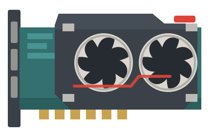
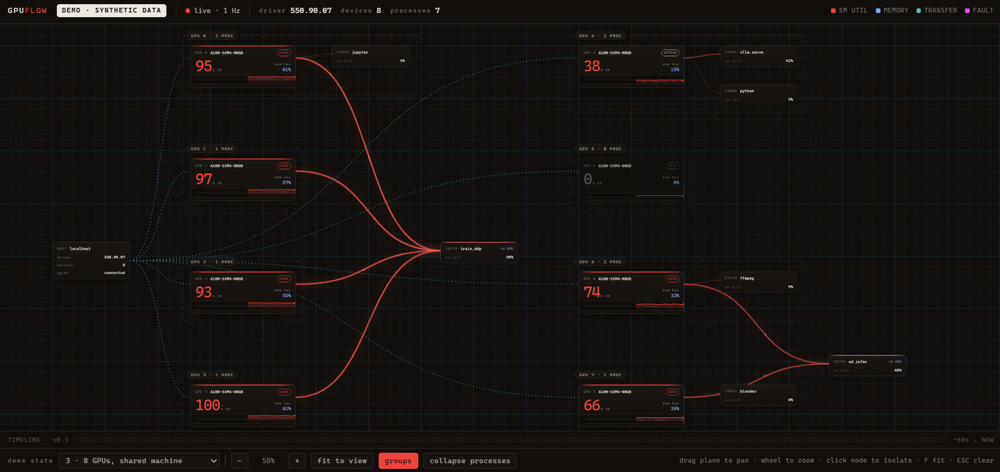

<p align="center">
  
</p>

<h1 align="center">GPUFlow</h1>

<p align="center">
  A live, browser-based view of what every process is doing on the machine's GPUs.
</p>

Two kinds of tool already exist, and neither covers the middle:

|                         | Live | Multi-process | Kernels & streams | Zero source changes |
| ----------------------- | :--: | :-----------: | :---------------: | :-----------------: |
| `nvidia-smi` / `nvtop`  |  ●   |       ●       |         ○         |          ●          |
| Nsight Systems/Compute  |  ○   |       ○       |         ●         |          ●          |
| Instrumentation libs    |  ●   |       ○       |         ●         |          ○          |
| **GPUFlow**             |  ●   |       ●       |         ●         |          ●          |

`nvidia-smi` and `nvtop` are live but flat — utilization and memory per process, and nothing about a kernel, a stream, or a copy. Nsight goes deep but offline: run, stop, open a trace file. Instrumentation libraries go deep and live but ask you to edit your source and rebuild.

GPUFlow aims at all four columns at once. You see every process on the card, and the kernels and streams inside the processes you launch through it.

## Status

**v0.1 — the passive layer.** NVML polling, an HTTP + SSE server with no dependencies beyond POSIX sockets, and a single-file node-graph browser UI.

**v0.2 — the kernel layer.** `gpuflow run <command>` launches a CUDA program with a CUPTI-based collector injected into it, with no changes to that program's source. Its kernels and copies flow along per-stream lanes in the browser as they run, next to per-kernel launch counts and transfer totals.

## Build and run

Linux, a working NVIDIA driver, and NVML headers. On Debian/Ubuntu the headers come from `libnvidia-ml-dev`, or from the CUDA toolkit. WSL2 works (see the limitations below).

```bash
cmake -B build -DCMAKE_BUILD_TYPE=Release
cmake --build build -j
./build/gpuflow watch
```

Then open <http://127.0.0.1:7717>.

To see inside a program rather than just around it:

```bash
./build/gpuflow run -- ./your-cuda-program --its-own --flags
```

That needs CUPTI, which ships with the CUDA toolkit rather than the driver. Without it the build still succeeds and `watch` still works; only `run` is unavailable.

If you do not have a CUDA program to point it at, `examples/demo_workload.cu` is one — a transformer-shaped launch pattern across three streams, written to make the lanes legible rather than to compute anything:

```bash
nvcc -o demo_workload examples/demo_workload.cu -lnvToolsExt
./build/gpuflow run -- ./demo_workload 600
```

```
usage: gpuflow watch [options]
       gpuflow run [options] -- <command> [args...]

  --bind ADDRESS     interface to listen on (default 127.0.0.1)
  --port PORT        port to listen on (default 7717)
  --interval MS      sampling interval in milliseconds (default 1000)
  --ui PATH          override the UI document path
  --ring-capacity N  event ring size in records, power of two (default 262144)
```

The UI is a pan/zoom plane: devices, the processes attached to them, and the host as connected nodes. Drag to pan, wheel to zoom, click a node to isolate it and its edges, `F` to fit, `Esc` to clear.

A process launched with `run` is marked `TRACED` and carries a lane strip — one row per CUDA stream, kernels in the SM colour, copies in the transfer colour. The strip states its own time window and how far behind live it is, and says how many of the executions it is actually showing.

Lanes are labelled by name if your program named its streams with `nvtxNameCudaStreamA`, as `default` for the null stream, and by id otherwise. GPUFlow will not guess a stream's purpose from the work that happened to land on it.

Appending `?demo` (or `?demo=shared`, `?demo=multigpu`, …) replays canned frames instead of the live stream — it exists so an eight-GPU box can be captured for a screenshot from a one-GPU laptop. Demo mode says so on screen and is never the default.

### On a shared box



One `train_ddp` process holds four cards; `sd_infer` holds two. That is one node with several edges, and it is the shape `nvidia-smi` cannot print — it repeats the same PID on four separate rows and drops the relationship between them.

Captured with `?demo=shared`: synthetic frames, labelled as such on screen, because the machine this was built on has one GPU.

## Limitations

Stated plainly, because precision about weaknesses is the difference between a tool people trust and a demo.

**NVML has a granularity ceiling.** The passive layer sees device utilization, device memory, and a per-process memory figure. It cannot see a kernel, a stream, or a copy — no polling interface can. That ceiling is the entire reason v0.2 exists.

**Per-process memory is unavailable under WDDM.** On Windows-model drivers, including WSL2, the kernel-mode driver owns the allocation and NVML reports `NVML_VALUE_NOT_AVAILABLE` for every process. GPUFlow shows `—` rather than a zero you would read as an idle process.

**Per-process SM utilization is unavailable on some setups.** `nvmlDeviceGetProcessUtilization` is unsupported on several virtualized and passthrough configurations, WSL2 among them. The same `—` applies; the device-wide trace is unaffected.

**WSL2 specifics.** Device utilization, device memory, and the process list work. Per-process memory and per-process utilization do not, per the two points above. Process *names* do work — GPUFlow reads `/proc/<pid>/comm`, where `nvidia-smi` reports `[Not Found]` under WSL2.

**Not a Windows-native build.** The server is hand-rolled on POSIX sockets and the event ring uses `shm_open`. Run it under WSL2 or on Linux; a native port would need Winsock2 and `CreateFileMapping` and is not on the roadmap.

**`run` can only instrument what it launches.** `CUDA_INJECTION64_PATH` is read at CUDA initialization, so a process that is already running cannot be attached to. The passive layer covers everything else. This is a property of the mechanism, not a limitation waiting to be fixed.

**The lanes are a sample, and say so.** A busy program produces around a hundred thousand kernel records a second — far more than can be sent to a browser or drawn by one. Per-kernel aggregates are always complete; the individual spans behind the lanes are capped per stream and most-recent-first, and `spans_elided` reports exactly how many were left out. A kernel's span reaches the browser about 120 ms after it ends, bounded by `GPUFLOW_FLUSH_MS`.

**`run` costs the observed program about 2.6 %.** Measured, launch-bound, on this machine — see `docs/overhead.md`, including why that percentage flatters itself under WSL2.

## Security

The stream carries the PIDs and process names of every user on the box. GPUFlow binds to `127.0.0.1` for that reason.

`--bind 0.0.0.0` exists and is unauthenticated. Anyone who can reach the port sees that list. Put it behind an SSH tunnel or a reverse proxy you control, or leave it on loopback.

## Design

Three decisions worth knowing before changing anything:

- **`Snapshot` is the only contract between layers.** The NVML layer and the future CUPTI layer both produce it; the transport and the UI consume nothing else. That is what lets the two collection layers evolve without touching each other.
- **SSE, not WebSocket.** Telemetry flows one direction, and `EventSource` reconnects on its own with zero client code. Kill the agent mid-session and the tab recovers by itself when it comes back.
- **No dependencies.** The server is hand-rolled on POSIX sockets and the JSON is hand-rolled. The UI is one HTML file — no framework, no build step, and the canvas engine is written out rather than pulled in.
- **The UI is a graph because the subject is a graph.** Processes attach to devices, one training job can hold four cards at once, and from v0.2 kernels advance along stream lanes. A table flattens exactly the structure the tool exists to show.

`CLAUDE.md` carries the full reasoning, the roadmap, and the conventions.

## Roadmap

- **v0.3** — SM occupancy grid, host↔device transfer edges weighted by bandwidth, timeline scrubbing over a retained window.
- **v0.4** — `gpuflow hub`: the same binary in aggregation mode across many hosts.

Overhead numbers are measured and republished every release, in [`docs/overhead.md`](docs/overhead.md). A profiler that can state its own cost is worth more than one that cannot.

## License

Apache-2.0.
